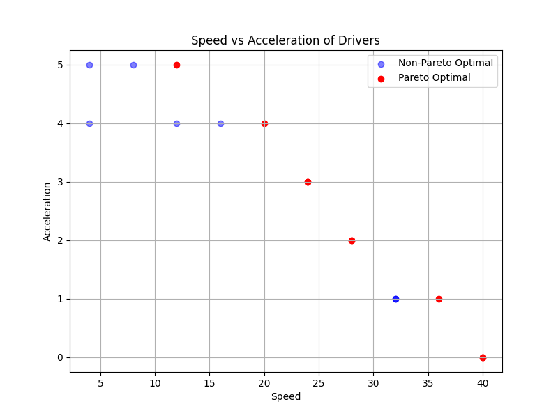
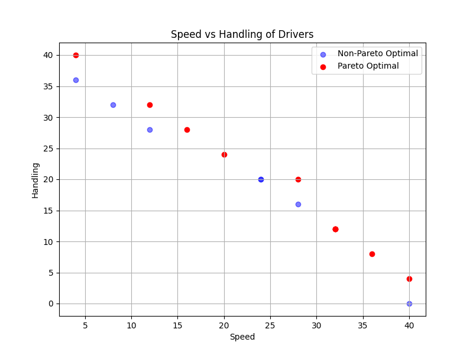
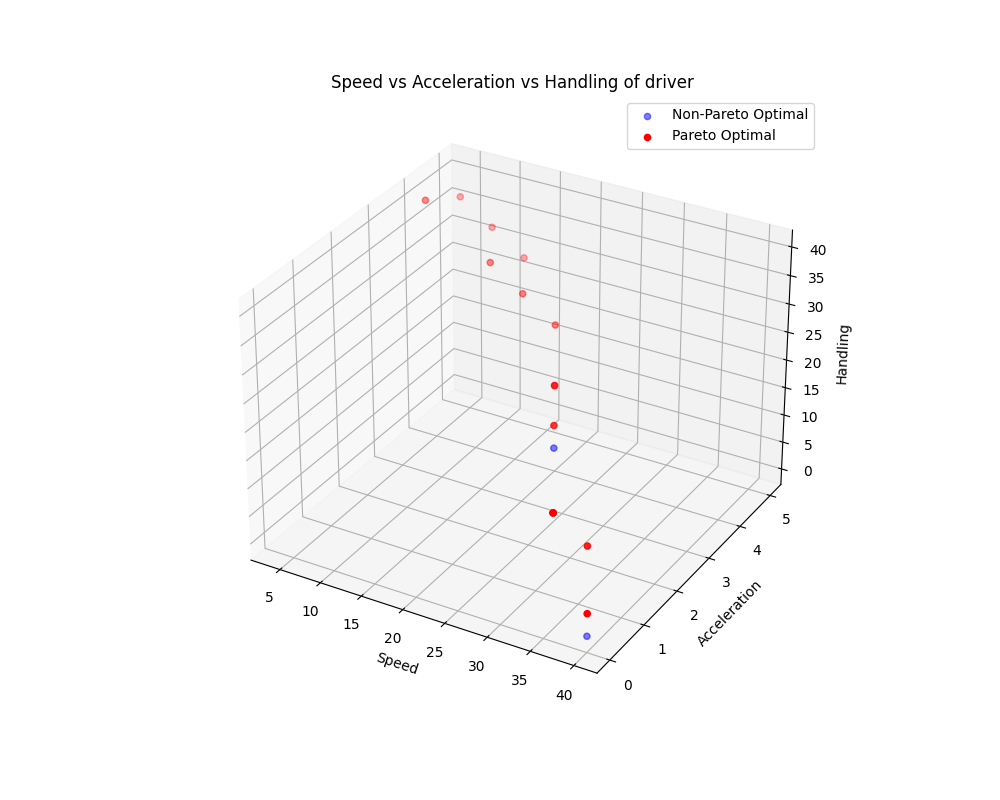

# Mario Kart 8 Deluxe - Pareto Dominance

## Driver Speed Acceleration

| Status    | Solution |
|-----------|----------|
| **Dominated** | |
| | Baby Peach  |
| | Baby Daisy  |
| | Baby Rosalina  |
| | Lemmy  |
| | Baby Mario  |
| | Baby Luigi  |
| | Dry Bones  |
| | Mii (Light)  |
| | Koopa Troopa  |
| | Lakitu  |
| | Bowser Jr.  |
| | Toad  |
| | Shy Guy  |
| | Larry  |
| | Rosalina  |
| | King Boo  |
| | Link  |
| | Link  |
| | Pauline  |
| | Metal Mario  |
| | Gold Mario  |
| | Pink Gold Peach  |
| | Petey Piranha  |
| **Optimal** | |
| | Toadette  |
| | Wendy  |
| | Isabelle  |
| | Cat Peach  |
| | Inkling (Female)  |
| | Villager (Female)  |
| | Diddy Kong  |
| | Peach  |
| | Daisy  |
| | Yoshi  |
| | Birdo  |
| | Peachette  |
| | Tanooki Mario  |
| | Inkling (Male)  |
| | Villager (Male)  |
| | Mario  |
| | Ludwig  |
| | Mii (Medium)  |
| | Luigi  |
| | Iggy  |
| | Kamek  |
| | Wiggler  |
| | Waluigi  |
| | Donkey Kong  |
| | Roy  |
| | Wario  |
| | Dry Bowser  |
| | Funky Kong  |
| | Mii (Heavy)  |
| | Bowser  |
| | Morton  |

## Driver Speed Handling

| Status    | Solution |
|-----------|----------|
| **Dominated** | |
| | Baby Rosalina  |
| | Lemmy  |
| | Baby Mario  |
| | Baby Luigi  |
| | Dry Bones  |
| | Mii (Light)  |
| | Toadette  |
| | Wendy  |
| | Isabelle  |
| | Peach  |
| | Daisy  |
| | Yoshi  |
| | Birdo  |
| | Peachette  |
| | Tanooki Mario  |
| | Inkling (Male)  |
| | Villager (Male)  |
| | Mario  |
| | Ludwig  |
| | Mii (Medium)  |
| | Bowser  |
| | Morton  |
| **Optimal** | |
| | Baby Peach  |
| | Baby Daisy  |
| | Koopa Troopa  |
| | Lakitu  |
| | Bowser Jr.  |
| | Toad  |
| | Shy Guy  |
| | Larry  |
| | Cat Peach  |
| | Inkling (Female)  |
| | Villager (Female)  |
| | Diddy Kong  |
| | Luigi  |
| | Iggy  |
| | Kamek  |
| | Rosalina  |
| | King Boo  |
| | Link  |
| | Link  |
| | Pauline  |
| | Metal Mario  |
| | Gold Mario  |
| | Pink Gold Peach  |
| | Petey Piranha  |
| | Wiggler  |
| | Waluigi  |
| | Donkey Kong  |
| | Roy  |
| | Wario  |
| | Dry Bowser  |
| | Funky Kong  |
| | Mii (Heavy)  |

## Driver Speed Acceleration Handling

| Status    | Solution |
|-----------|----------|
| **Dominated** | |
| | Mario  |
| | Ludwig  |
| | Mii (Medium)  |
| | Bowser  |
| | Morton  |
| **Optimal** | |
| | Baby Peach  |
| | Baby Daisy  |
| | Baby Rosalina  |
| | Lemmy  |
| | Baby Mario  |
| | Baby Luigi  |
| | Dry Bones  |
| | Mii (Light)  |
| | Koopa Troopa  |
| | Lakitu  |
| | Bowser Jr.  |
| | Toadette  |
| | Wendy  |
| | Isabelle  |
| | Toad  |
| | Shy Guy  |
| | Larry  |
| | Cat Peach  |
| | Inkling (Female)  |
| | Villager (Female)  |
| | Diddy Kong  |
| | Peach  |
| | Daisy  |
| | Yoshi  |
| | Birdo  |
| | Peachette  |
| | Tanooki Mario  |
| | Inkling (Male)  |
| | Villager (Male)  |
| | Luigi  |
| | Iggy  |
| | Kamek  |
| | Rosalina  |
| | King Boo  |
| | Link  |
| | Link  |
| | Pauline  |
| | Metal Mario  |
| | Gold Mario  |
| | Pink Gold Peach  |
| | Petey Piranha  |
| | Wiggler  |
| | Waluigi  |
| | Donkey Kong  |
| | Roy  |
| | Wario  |
| | Dry Bowser  |
| | Funky Kong  |
| | Mii (Heavy)  |

## Driver Speed Acceleration Handling Invincibility

| Status    | Solution |
|-----------|----------|
| **Dominated** | |
| | Mario  |
| | Ludwig  |
| | Mii (Medium)  |
| | Rosalina  |
| | King Boo  |
| | Link  |
| | Link  |
| | Pauline  |
| | Metal Mario  |
| | Gold Mario  |
| | Pink Gold Peach  |
| **Optimal** | |
| | Baby Peach  |
| | Baby Daisy  |
| | Baby Rosalina  |
| | Lemmy  |
| | Baby Mario  |
| | Baby Luigi  |
| | Dry Bones  |
| | Mii (Light)  |
| | Koopa Troopa  |
| | Lakitu  |
| | Bowser Jr.  |
| | Toadette  |
| | Wendy  |
| | Isabelle  |
| | Toad  |
| | Shy Guy  |
| | Larry  |
| | Cat Peach  |
| | Inkling (Female)  |
| | Villager (Female)  |
| | Diddy Kong  |
| | Peach  |
| | Daisy  |
| | Yoshi  |
| | Birdo  |
| | Peachette  |
| | Tanooki Mario  |
| | Inkling (Male)  |
| | Villager (Male)  |
| | Luigi  |
| | Iggy  |
| | Kamek  |
| | Petey Piranha  |
| | Wiggler  |
| | Waluigi  |
| | Donkey Kong  |
| | Roy  |
| | Wario  |
| | Dry Bowser  |
| | Funky Kong  |
| | Mii (Heavy)  |
| | Bowser  |
| | Morton  |